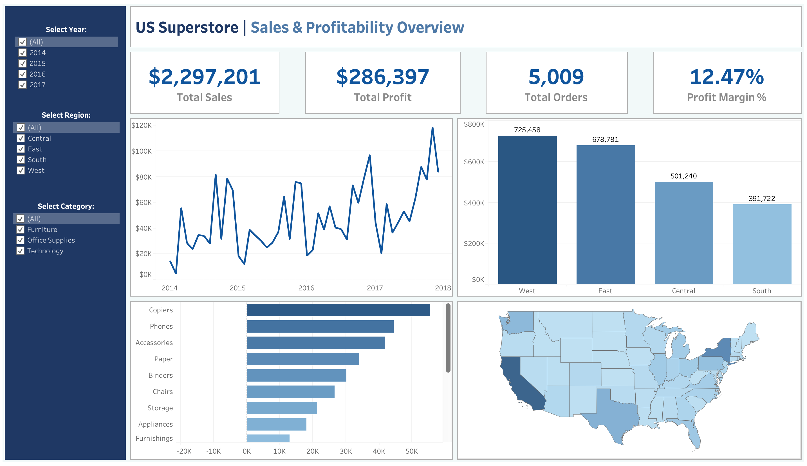

# 🛒 Superstore Sales Analysis

End-to-end exploratory data analysis and interactive dashboard for the Sample Superstore dataset using Python, SQL, and Tableau.

---

## 📌 Overview
This project analyzes 9,994 retail orders from a US-based superstore (2014–2017) to uncover insights around sales performance, profitability, regional trends, and the impact of discounting.

---

## 🛠️ Tools & Libraries
| Tool | Purpose |
|---|---|
| Python | Core analysis language |
| Pandas & NumPy | Data manipulation |
| Matplotlib & Seaborn | Data visualization |
| SQLite | SQL-based querying |
| Tableau Public | Interactive dashboard |
| Google Colab | Development environment |

---

## 📁 Project Structure
```
Superstore_Sales_Analysis.ipynb
Superstore_Sales_Dashboard.twbx
dashboard_preview.png
```

---

## 📊 What's Covered
1. 🔍 **Data Loading & Inspection** — shape, columns, data types
2. 🧹 **Data Cleaning** — standardising column names, fixing data types, checking for nulls and duplicates
3. ⚙️ **Feature Engineering** — order year, order month, profit margin
4. 📈 **Exploratory Data Analysis**
   - Overall sales & profit
   - Sales & profit by category
   - Sales & profit by region
   - Monthly sales trend (2014–2017)
   - Discount vs profit relationship
5. 🗄️ **SQL Analysis** — business insight queries using SQLite
6. 💾 **Export** — cleaned dataset saved as CSV
7. 📊 **Tableau Dashboard** — interactive sales performance dashboard

---

## 📊 Dashboard Preview


> Download `Superstore_Sales_Dashboard.twbx` and open in Tableau Public to interact with the full dashboard.

---

## 💡 Key Insights
- 💻 **Technology** is the most profitable category; **Furniture** underperforms despite similar revenue to Office Supplies
- 🌍 The **West** region leads in both sales and profit
- 📅 Sales peak consistently in **September, November, and December** every year
- 🏷️ Heavy discounting (above ~30%) strongly correlates with **negative profit**
- ⚠️ Sub-categories like **Tables** and **Bookcases** generate losses overall

---

## 📂 Dataset
[Sample - Superstore](https://www.kaggle.com/datasets/vivek468/superstore-dataset-final) — publicly available on Kaggle
